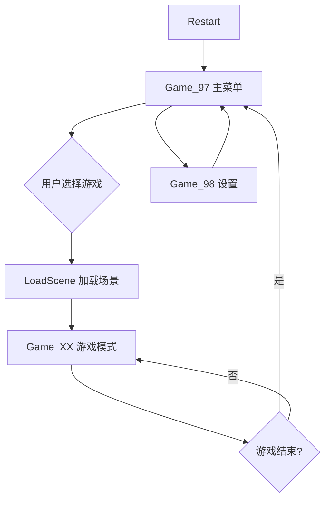
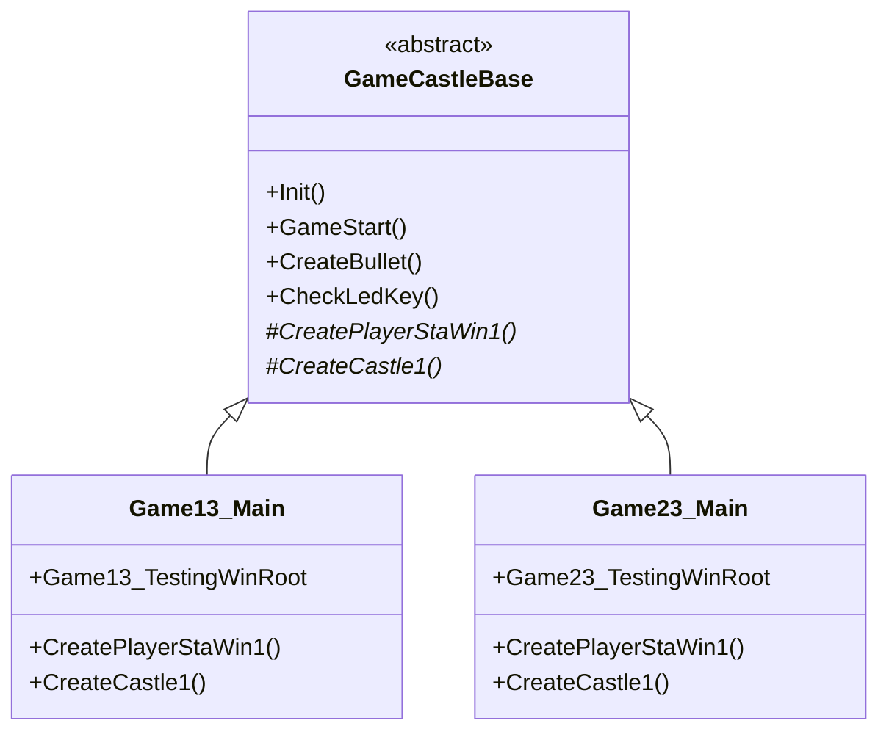
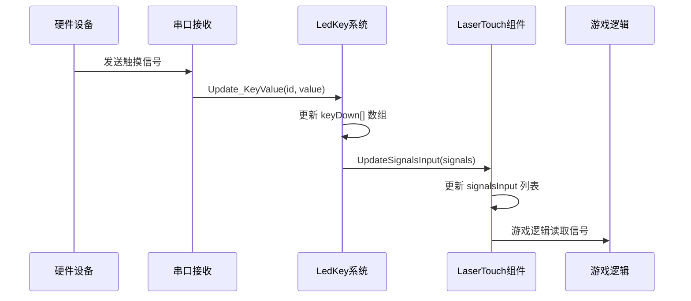

# 镭射拍拍灯 (LaserPPD) 技术开发文档

> **版本**: KuPao_LaserBtn_v01.01.04  
> **目标读者**: 新加入团队的 Unity 开发人员  
> **最后更新**: 2024

---

## 目录

1. [项目概述](#1-项目概述-project-overview)
2. [项目目录结构](#2-项目目录结构-project-structure)
3. [核心架构](#3-核心架构-core-architecture)
4. [关键系统详解](#4-关键系统详解-key-systems)
5. [开发环境搭建](#5-开发环境搭建-setup-guide)
6. [代码规范与注意事项](#6-代码规范与注意事项-best-practices)

---

## 1. 项目概述 (Project Overview)

### 1.1 项目简介

**镭射拍拍灯 (LaserPPD)** 是一个结合硬件交互的 Unity 互动投影/激光游戏项目。项目通过串口通信控制激光设备（LED 矩阵、拍拍灯等），实现多种游戏模式的物理交互体验。

**核心特性**：
- 🎮 **多游戏模式**: 支持 8+ 种不同的游戏玩法（Game00-Game07, Game13-Game15, Game97）
- 💡 **硬件交互**: 通过串口控制激光设备、LED 矩阵、触摸区域
- 🎯 **实时响应**: 激光触摸检测、信号输入处理、LED 状态同步
- 📊 **数据持久化**: 游戏设置、排行榜、用户数据保存

### 1.2 技术栈

| 技术/工具 | 版本/说明 |
|---------|---------|
| **Unity** | Unity 2022.x (推荐) |
| **编程语言** | C# (.NET Framework) |
| **硬件通信** | 串口通信 (UART) - Windows/Android 双平台支持 |
| **数据序列化** | `JsonUtility`, `BinaryFormatter`, `PlayerPrefs` |
| **UI 框架** | Unity UI (uGUI) |
| **架构模式** | 单例模式、状态机、接口抽象、继承/组合 |

### 1.3 硬件支持

- **激光设备**: 支持最多 6 通道 LED 控制，每通道最多 192 个 LED
- **拍拍灯**: 触摸区域检测（通道 5/6）
- **串口协议**: 
  - `CmdIO_YDGZ`: 激光设备通信（115200 baud）
  - `CmdIO_WeChat`: 微信/外设通信（9600 baud）
  - `CmdIO_PPL` / `CmdIO_PPLJL`: 拍拍灯协议（38400 baud）

---

## 2. 项目目录结构 (Project Structure)

### 2.1 核心目录说明

```
Assets/Scripts/
├── Main.cs                    # ⭐ 游戏主控制器（上帝类）
├── MainRun.cs                 # 串口初始化和硬件通信管理
│
├── Fun/                       # 功能模块（通用工具类）
│   ├── CmdIO_*.cs            # 硬件通信协议类
│   ├── GameLedControl.cs     # LED 控制核心逻辑
│   ├── GameSetting.cs        # 游戏设置数据结构
│   ├── BaseGamePoint.cs      # 统一游戏点结构体（基础）
│   ├── IHardwareProtocol.cs # 硬件协议接口
│   └── YDGZProtocol.cs      # YDGZ 协议实现
│
├── Game/                      # 游戏逻辑模块
│   ├── Game00/               # 游戏模式 00（固定点游戏）
│   ├── Game01/               # 游戏模式 01（镭射模式）
│   ├── Game02-Game07/        # 其他游戏模式
│   ├── Game13/               # 城堡攻防游戏（双人）
│   │   ├── GameCastleBase.cs # ⭐ 抽象基类（公共逻辑）
│   │   ├── Game13_Main.cs    # Game13 具体实现
│   │   └── Game23_Main.cs    # Game23 具体实现
│   ├── Game97/               # 主菜单/待机界面
│   ├── LaserPPD/             # 激光控制模块
│   │   ├── ILaserController.cs # 激光控制器接口
│   │   └── LaserController.cs  # 激光控制器实现
│   ├── LaserTouch.cs         # 触摸信号处理
│   └── Game_Map/             # 地图绘制逻辑
│
├── Menu/                      # 菜单系统
│   └── Scripts/              # 菜单相关脚本
│
├── Lib/                       # 底层库
│   ├── Uart_Windows.cs      # Windows 串口封装
│   └── Uart_Android.cs      # Android 串口封装
│
└── Prefab/                    # 通用预制体脚本
```

### 2.2 游戏模式目录说明

| 目录 | 游戏模式 | 说明 |
|-----|---------|------|
| `Game00/` | 固定点游戏 | 玩家需要点击固定位置的 LED 点 |
| `Game01/` | 镭射模式 | 使用激光笔/镭射设备进行交互 |
| `Game02-Game07/` | 其他模式 | 各种变体游戏玩法 |
| `Game13/` | 城堡攻防 | 双人对战，使用 `GameCastleBase` 基类 |
| `Game97/` | 主菜单 | 游戏选择、设置界面 |

---

## 3. 核心架构 (Core Architecture)

### 3.1 游戏生命周期管理 - Main.cs

`Main.cs` 是整个项目的**核心控制器（上帝类）**，负责：

#### 3.1.1 状态机管理

项目使用 `en_MainStatue` 枚举管理游戏状态：

```csharp
public enum en_MainStatue
{
    Restart = -1,      // 开机/重启
    Game_00 = 0,       // 游戏模式 00
    Game_01,           // 游戏模式 01
    // ... Game_02 到 Game_07
    Game_97,           // 主菜单
    Game_98,           // 设置界面
    LoadScene,         // 场景加载中
    Menu,              // 菜单状态
    Game,              // 游戏进行中
}
```

**状态切换流程**：



#### 3.1.2 游戏模式切换

`Main.cs` 通过 `ChangeScene()` 方法切换游戏模式：

```csharp
public void ChangeScene(en_MainStatue gameno)
{
    // 1. 卸载旧场景资源
    Resources.UnloadUnusedAssets();
    
    // 2. 异步加载新场景
    async = SceneManager.LoadSceneAsync("Game_" + ((int)gameno).ToString("D2"), LoadSceneMode.Additive);
    
    // 3. 切换到加载状态
    nextStatue = gameno;
    ChangeStatue(en_MainStatue.LoadScene);
}
```

**关键静态变量**：
- `Main.statue`: 当前游戏状态
- `Main.nextStatue`: 下一个目标状态
- `Main.gameId`: 当前游戏 ID
- `Main.PlayTime`: 全局游戏时间

#### 3.1.3 单例模式

```csharp
public class Main : MonoBehaviour
{
    public static Main instance;  // 全局单例
    
    void Awake()
    {
        instance = this;
        // ... 初始化逻辑
    }
}
```

**⚠️ 注意事项**: 项目中大量使用静态单例模式，虽然方便访问，但增加了耦合度。新代码建议使用依赖注入或接口抽象。

---

### 3.2 硬件抽象层架构

项目采用**分层架构**解耦硬件通信：

```
游戏逻辑层
    ↓ (调用接口)
ILaserController / IHardwareProtocol
    ↓ (实现)
LaserController / YDGZProtocol
    ↓ (委托)
CmdIO_YDGZ (静态类)
    ↓ (串口发送)
Uart_Windows / Uart_Android
    ↓
硬件设备
```

#### 3.2.1 激光控制接口 - ILaserController

```csharp
public interface ILaserController
{
    void InitMatrix(int width, int height);
    void SendMatrix(int[,] targetMatrix);
    void SendLaserData(int laserId, bool isOpen, uint[] data, int length);
    uint[] MatrixToIndexArray(int[,] matrix);
}
```

**使用示例**：
```csharp
// 在游戏逻辑中
ILaserController laserController = GetComponent<LaserController>();
laserController.InitMatrix(16, 12);  // 初始化 16x12 矩阵

int[,] gameMatrix = new int[12, 16];
// ... 填充游戏数据
laserController.SendMatrix(gameMatrix);  // 发送到硬件
```

#### 3.2.2 硬件协议接口 - IHardwareProtocol

```csharp
public interface IHardwareProtocol
{
    bool IsConnected { get; }
    void Init(SendData funSendData);
    void CheckConnect();
    void SendLedOne(int channel, uint color, uint[] indices, int length);
    void SendLedAll(uint color);
    void SendLine();
    void SendProtocol();
}
```

**实现类**: `YDGZProtocol` 封装了 `CmdIO_YDGZ` 的静态方法调用。

#### 3.2.3 串口初始化流程

`MainRun.cs` 负责串口初始化：

```csharp
void Awake()
{
    // 1. 根据平台创建串口实例
#if UNITY_EDITOR || UNITY_STANDALONE_WIN
    uartYDGZ = new Uart_Windows();
#elif UNITY_ANDROID
    uartYDGZ = new Uart_Android();
#endif

    // 2. 初始化协议
    CmdIO_YDGZ.Init(uartYDGZ.SendData);
    
    // 3. 打开串口（根据硬件版本选择不同端口）
#if UNITY_EDITOR || UNITY_STANDALONE_WIN
    uartYDGZ.Init(3, 115200, CmdIO_YDGZ.LAN_SetCode);
#endif
}
```

**串口配置**（不同硬件版本）：
- `VER_A33`: 端口 2 (38400), 端口 3 (115200)
- `VER_S905`: 端口 4 (38400), 端口 2 (115200)
- `VER_H6`: 端口 1 (38400), 端口 2 (115200)

---

### 3.3 多游戏模式管理

#### 3.3.1 游戏模式基类模式

**Game13 系列**使用了**抽象基类 + 适配器模式**：



**优势**：
- ✅ 公共逻辑集中在 `GameCastleBase`
- ✅ 子类只需实现类型特定的 UI 引用和对象创建
- ✅ 代码复用率大幅提升（从 ~450 行减少到 ~80 行）

**示例代码**：
```csharp
// GameCastleBase.cs (基类)
public abstract class GameCastleBase : MonoBehaviour
{
    // 公共字段和方法
    protected abstract BasePlayerStaWin CreatePlayerStaWin1(...);
    protected abstract BaseCastle CreateCastle1(...);
    
    public void GameStart()  // 公共逻辑
    {
        // ... 通用游戏启动逻辑
        playerStaWin1 = CreatePlayerStaWin1(...);  // 调用抽象方法
    }
}

// Game13_Main.cs (子类)
public class Game13_Main : GameCastleBase
{
    protected override BasePlayerStaWin CreatePlayerStaWin1(...)
    {
        return new Game13_PlayerStaWinAdapter(...);  // 返回 Game13 特定类型
    }
}
```

#### 3.3.2 其他游戏模式

`Game00`、`Game01` 等使用**独立实现**，每个游戏模式有自己的状态机：

```csharp
// Game00_Main.cs
public enum en_Game00_Sta
{
    None = 0,
    Idle,
    ShowLevel,
    Ready,
    Play,
    ShowResult,
    End,
}

public class Game00_Main : MonoBehaviour
{
    public en_Game00_Sta statue;
    
    void Update()
    {
        switch (statue)
        {
            case en_Game00_Sta.Ready:
                // 准备阶段逻辑
                break;
            case en_Game00_Sta.Play:
                // 游戏进行中逻辑
                break;
        }
    }
}
```

---

## 4. 关键系统详解 (Key Systems)

### 4.1 输入系统 - 激光触摸检测

#### 4.1.1 信号输入流程



#### 4.1.2 LaserTouch 组件

`LaserTouch.cs` 负责管理触摸区域和激光区域：

```csharp
public class LaserTouch : MonoBehaviour
{
    public List<int> signalsInput = new List<int>();  // 信号输入列表
    public TouchArea touchArea1, touchArea2;           // 触摸区域
    public LaserArea LaserArea;                        // 激光区域
    public GameState_LaserTouch state;                 // 状态机
    
    // 更新信号输入（已修复逻辑错误）
    public void UpdateSignalsInput(List<int> newSignalsInput)
    {
        // 1. 空值检查
        if (newSignalsInput == null) return;
        
        // 2. 调整列表大小
        if (this.signalsInput.Count < newSignalsInput.Count)
        {
            // 扩展列表
            for (int i = this.signalsInput.Count; i < newSignalsInput.Count; i++)
                this.signalsInput.Add(0);
        }
        else if (this.signalsInput.Count > newSignalsInput.Count)
        {
            // 截断列表
            this.signalsInput.RemoveRange(newSignalsInput.Count, 
                this.signalsInput.Count - newSignalsInput.Count);
        }
        
        // 3. 复制值（确保信号不丢失）
        for (int i = 0; i < newSignalsInput.Count; i++)
        {
            this.signalsInput[i] = newSignalsInput[i];
        }
    }
}
```

**⚠️ 重要修复**: `UpdateSignalsInput` 方法之前存在逻辑错误（在遍历前清空列表），现已修复为正确的值复制逻辑。

#### 4.1.3 LedKey 系统

`LedKey.cs` 提供全局按键状态管理：

```csharp
public class LedKey
{
    static byte[] keyDown = new byte[Main.MAX_LED];      // 按下事件
    static byte[] holdSta = new byte[Main.MAX_LED];       // 保持状态
    static float[] holdTime = new float[Main.MAX_LED];    // 保持时间
    
    public static void Update_KeyValue(int id, byte value)
    {
        if (keyOld[id] != KEYDOWN_VALUE && value == KEYDOWN_VALUE)
        {
            keyDown[id] = 1;  // 触发按下事件
        }
        // ... 更新保持状态
    }
}
```

**LED 索引映射**：
- **镭射设备**: 序号 80~159（80 个镭射点）
- **拍拍灯通道 5**: 序号 160~221（220/221 为开始/结束按钮）
- **拍拍灯通道 6**: 序号 222~281

---

### 4.2 配置系统

#### 4.2.1 游戏设置加载

项目使用**混合配置方式**：

1. **ScriptableObject** (部分游戏使用)
   ```csharp
   // SettingInGame_00.cs
   [CreateAssetMenu(fileName = "Game00Settings", menuName = "Game Settings/Game 00 Settings")]
   public class SettingInGame_00 : ScriptableObject
   {
       public int[] tab_BlueNum = { 20, 25, 30, 40, 50, 60, 70, 80, 90, 100 };
       public int[] tab_TarageNum = { 20, 30, 40, 50, 60, 70, 80, 90, 100 };
       // ...
   }
   ```

2. **PlayerPrefs** (全局设置)
   ```csharp
   // Set.cs
   public static void LoadAll()
   {
       // 加载语言、游戏模式等全局设置
       setVal.Language = PlayerPrefs.GetInt(SET_Language);
       setVal.GameMode = PlayerPrefs.GetInt(SET_GameMode);
       // ...
   }
   ```

3. **二进制文件** (游戏关卡数据)
   ```csharp
   // GameSetting.cs
   public void Save(string path)
   {
       BinaryFormatter formatter = new BinaryFormatter();
       FileStream stream = new FileStream(path, FileMode.Create);
       formatter.Serialize(stream, this);
       stream.Close();
   }
   ```

#### 4.2.2 数据结构

**GameSetting** (游戏设置):
```csharp
public class GameSetting
{
    public int maxLevel;                              // 最大关卡数
    public GameLevelSetting[] gameLevelSetting;      // 关卡设置数组
}

public class GameLevelSetting
{
    public int gameTime;        // 游戏时间（秒）
    public int life;            // 生命数
    public int targetPoint;     // 目标点数
    public int wallLedNum;      // 墙灯个数
    public string presetPicName; // 预设图片名称
}
```

**存储路径**：
- Windows: `Application.persistentDataPath` + `/YueDongGeZi/`
- Android: `/sdcard/YueDongGeZi/`

---

### 4.3 数据结构 - GamePoint 统一模型

#### 4.3.1 BaseGamePoint 基础结构

项目重构后，统一使用 `BaseGamePoint` 作为所有游戏点的基础：

```csharp
public struct BaseGamePoint
{
    public enPointSta statue;  // 点状态（None, Target, Die, ...）
    public uint color;          // 颜色值（RGB uint）
}
```

#### 4.3.2 GamePoint 统一结构体

```csharp
public struct GamePoint
{
    public BaseGamePoint basePoint;  // 基础字段
    
    // 通用 LED 控制字段
    public int time;           // 死亡动画时间
    public int errorTime;      // 错误闪烁时间
    public float tarageTime;   // 目标时间
    
    // 镭射模式字段
    public int bindCnt;       // 绑定计数（闪烁次数）
    public float bindTime;    // 绑定时间（闪烁间隔）
    public bool error;        // 错误标志
    
    // 属性访问器（向后兼容）
    public enPointSta statue { get => basePoint.statue; set => basePoint.statue = value; }
    public uint Color { get => basePoint.color; set => basePoint.color = value; }  // 大写C
    public uint color { get => basePoint.color; set => basePoint.color = value; }  // 小写c
}
```

**使用场景**：
- `GameLedControl`: 使用 `GamePoint[]` 管理所有 LED 点状态
- `GameLeiSheBase`: 已迁移到统一的 `GamePoint`（之前使用 `GameLeiShePoint`，现已废弃）

**⚠️ 注意事项**: 
- 新代码应统一使用 `GamePoint` 结构体
- `GameLeiShePoint` 已标记 `[Obsolete]`，仅保留向后兼容

---

### 4.4 UI 框架

项目使用 **Unity UI (uGUI)**，每个游戏模式有独立的 UI 管理类：

**命名规范**：
- `GameXX_GameUI`: 游戏 UI 主类
- `GameXX_GameUIComm`: 游戏 UI 通用组件
- `GameXX_PlayerUI`: 玩家 UI（单人/多人）

**示例**：
```csharp
// Game00_Main.cs
public class Game00_Main : MonoBehaviour
{
    public Game00_GameUIComm gameUIComm;      // 通用 UI
    public Game00_GameUI gameUI_Single;       // 单人 UI
    public Game00_GameUI gameUI_MulitPlayer;   // 多人 UI
    
    void Start()
    {
        if (Main.playerNum == 1)
            gameUI = gameUI_Single;
        else
            gameUI = gameUI_MulitPlayer;
    }
}
```

---

## 5. 开发环境搭建 (Setup Guide)

### 5.1 Unity 项目设置

#### 5.1.1 重新生成 Visual Studio 项目文件

如果项目文件丢失或损坏：

1. **Unity Editor**:
   - `Edit` → `Preferences` → `External Tools`
   - 设置 **External Script Editor** 为 Visual Studio
   - 点击 **Regenerate project files**

2. **命令行** (可选):
   ```bash
   Unity.exe -batchmode -quit -projectPath "项目路径" -executeMethod UnityEditor.SyncVS.SyncSolution
   ```

#### 5.1.2 清理冗余项目文件

项目根目录可能包含大量历史遗留的 `.sln` 和 `.csproj` 文件，使用提供的清理脚本：

```bash
# 运行清理脚本
python cleanup_project_files.py
```

脚本会：
- ✅ 列出所有 `.sln` 和 `.csproj` 文件
- ✅ 询问是否删除（安全确认）
- ✅ 可选择保留 Unity 自动生成的文件（`Assembly-CSharp*.csproj`）

---

### 5.2 硬件模拟测试

#### 5.2.1 编辑器模式测试

项目支持在 **Unity Editor** 中模拟硬件通信：

**条件编译**：
```csharp
#if UNITY_EDITOR || UNITY_STANDALONE_WIN
    // Windows 平台代码（使用 Uart_Windows）
    uartYDGZ = new Uart_Windows();
#elif UNITY_ANDROID
    // Android 平台代码（使用 Uart_Android）
    uartYDGZ = new Uart_Android();
#endif
```

**测试模式**：
```csharp
#if FPS_TEST
    // 测试模式：不发送实际数据
    static void UartSendData(byte[] buf, int len) { }
#endif
```

#### 5.2.2 键盘模拟输入

在 Editor 中可以使用键盘模拟 LED 按键：

```csharp
#if UNITY_EDITOR
    Key.KeyTest_ForKeybord();  // 键盘测试
#endif
```

**快捷键**（部分）：
- `L`: 测试 LED 输出
- `K`: 切换 LED 状态
- `P`: 清零游戏时间
- `Q/W`: 测试点阵显示

---

### 5.3 串口调试

#### 5.3.1 Windows 串口工具

推荐使用 **串口调试助手** 或 **PuTTY** 测试硬件通信。

**串口配置**：
- **YDGZ 协议**: COM3, 115200 baud, 8N1
- **WeChat 协议**: COM4, 9600 baud, 8N1
- **拍拍灯协议**: COM1, 38400 baud, 8N1

#### 5.3.2 日志输出

项目使用 `Debug.Log` 输出调试信息：

```csharp
#if UNITY_EDITOR
    Debug.Log("SendCmd: " + cmd.ToString("X2"));  // 十六进制输出
#endif
```

**查看日志**：
- **Unity Editor**: `Console` 窗口
- **Android**: `adb logcat` 或 Unity Remote

---

## 6. 代码规范与注意事项 (Best Practices)

### 6.1 架构模式使用规范

#### 6.1.1 静态单例模式

**现状**: 项目中大量使用静态单例（`Main.instance`, `Set.setVal` 等）

**问题**:
- ❌ 高耦合：难以进行单元测试
- ❌ 全局状态：容易产生副作用
- ❌ 难以扩展：添加新功能需要修改核心类

**建议**:
- ✅ 新功能使用**依赖注入**或**接口抽象**
- ✅ 考虑使用 **Service Locator** 模式替代全局单例
- ✅ 逐步重构为**事件驱动架构**

**示例**（推荐）：
```csharp
// ❌ 不推荐：直接访问静态单例
Main.instance.ChangeStatue(en_MainStatue.Game_00);

// ✅ 推荐：通过接口注入
public class MyGameLogic
{
    private IGameStateManager stateManager;
    
    public MyGameLogic(IGameStateManager stateManager)
    {
        this.stateManager = stateManager;
    }
    
    public void StartGame()
    {
        stateManager.ChangeState(GameState.Game00);
    }
}
```

#### 6.1.2 接口抽象层

**已实现**: `ILaserController`, `IHardwareProtocol`

**使用规范**:
- ✅ 游戏逻辑层应依赖接口，而非具体实现
- ✅ 通过 `SetHardwareProtocol()` 注入协议实现
- ✅ 便于单元测试和协议切换

**示例**：
```csharp
// ✅ 正确：依赖接口
public class MyGame : MonoBehaviour
{
    private ILaserController laserController;
    
    void Start()
    {
        laserController = GetComponent<ILaserController>();
        laserController.InitMatrix(16, 12);
    }
}

// ❌ 错误：直接依赖具体类
public class MyGame : MonoBehaviour
{
    private LaserController laserController;  // 不推荐
}
```

---

### 6.2 数据结构使用规范

#### 6.2.1 GamePoint 统一结构

**强制要求**: 所有新代码必须使用统一的 `GamePoint` 结构体

**迁移指南**：
```csharp
// ❌ 旧代码（已废弃）
GameLeiShePoint point = new GameLeiShePoint(enPointSta.Target, 0xff0000);

// ✅ 新代码（推荐）
GamePoint point = new GamePoint(enPointSta.Target, 0xff0000);

// ✅ 如果需要镭射模式字段
GamePoint point = new GamePoint(enPointSta.Target, 0xff0000);
point.bindCnt = 3;
point.bindTime = 0.5f;
```

**向后兼容**: `GameLeiShePoint` 已实现隐式转换，旧代码仍可编译，但会显示警告。

---

### 6.3 命名规范

#### 6.3.1 文件命名

- ✅ **类名与文件名一致**: `LaserController.cs` → `class LaserController`
- ✅ **游戏模式**: `GameXX_Main.cs` (XX 为两位数)
- ✅ **接口**: `I` 前缀，如 `ILaserController.cs`
- ❌ **避免**: 版本后缀 `_old`, `_v2`, `(1)` 等

#### 6.3.2 变量命名

- **公共字段**: `PascalCase`，如 `public int GameTime;`
- **私有字段**: `camelCase`，如 `private int gameTime;`
- **静态字段**: `PascalCase`，如 `public static Main instance;`
- **常量**: `UPPER_SNAKE_CASE`，如 `public const int MAX_LED = 192;`

---

### 6.4 常见陷阱与注意事项

#### 6.4.1 信号输入处理

**⚠️ 重要**: `LaserTouch.UpdateSignalsInput()` 已修复逻辑错误

**错误示例**（已修复）：
```csharp
// ❌ 错误：在遍历前清空列表
public void UpdateSignalsInput(List<int> newSignalsInput)
{
    signalsInput.Clear();  // ❌ 错误：会导致信号丢失
    foreach (var signal in newSignalsInput)
        signalsInput.Add(signal);
}
```

**正确实现**（当前版本）：
```csharp
// ✅ 正确：调整大小后复制值
public void UpdateSignalsInput(List<int> newSignalsInput)
{
    // 1. 调整列表大小
    // 2. 按索引复制值（确保不丢失）
    for (int i = 0; i < newCount; i++)
        this.signalsInput[i] = newSignalsInput[i];
}
```

#### 6.4.2 矩阵转换顺序

**⚠️ 注意**: `MatrixToIndexArray()` 使用 **S 形扫描**（蛇形扫描）

```csharp
// 矩阵转索引数组（S形扫描）
// 第 0 行: 从左到右 (0, 1, 2, ...)
// 第 1 行: 从右到左 (..., 2, 1, 0)
// 第 2 行: 从左到右
// ...
```

**硬件映射**: 确保矩阵数据与硬件 LED 排列顺序一致。

#### 6.4.3 串口初始化顺序

**⚠️ 重要**: 串口初始化必须在 `MainRun.Awake()` 中完成，且早于游戏逻辑初始化。

**初始化顺序**：
1. `MainRun.Awake()` - 串口初始化
2. `Main.Awake()` - 游戏对象初始化
3. `Main.Start()` - 游戏设置加载
4. 游戏逻辑开始运行

---

### 6.5 性能优化建议

#### 6.5.1 避免频繁的矩阵转换

```csharp
// ❌ 不推荐：每帧都转换矩阵
void Update()
{
    uint[] data = MatrixToIndexArray(gameMatrix);
    laserController.SendLaserData(0, true, data, data.Length);
}

// ✅ 推荐：只在矩阵变化时转换
void Update()
{
    if (matrixChanged)
    {
        uint[] data = MatrixToIndexArray(gameMatrix);
        laserController.SendLaserData(0, true, data, data.Length);
        matrixChanged = false;
    }
}
```

#### 6.5.2 对象池模式

对于频繁创建/销毁的对象（如子弹、特效），考虑使用对象池：

```csharp
// 示例：子弹对象池
public class BulletPool
{
    private Queue<BaseBullet> pool = new Queue<BaseBullet>();
    
    public BaseBullet Get()
    {
        if (pool.Count > 0)
            return pool.Dequeue();
        return Instantiate(bulletPrefab);
    }
    
    public void Return(BaseBullet bullet)
    {
        bullet.gameObject.SetActive(false);
        pool.Enqueue(bullet);
    }
}
```

---

### 6.6 调试技巧

#### 6.6.1 Unity Profiler

使用 **Unity Profiler** 分析性能瓶颈：
- `Window` → `Analysis` → `Profiler`
- 重点关注：`Update()`, `LateUpdate()`, 串口通信开销

#### 6.6.2 条件编译调试

```csharp
#if UNITY_EDITOR
    Debug.Log($"GameState: {statue}, Time: {Time.time}");
#endif

#if DEBUG_TEST
    // 测试专用代码
    TestHardwareConnection();
#endif
```

#### 6.6.3 硬件通信日志

启用串口数据日志（开发阶段）：
```csharp
#if UNITY_EDITOR
    string str = "";
    for (int i = 0; i < len + 4; i++)
        str += OutBuf[i].ToString("X2") + " ";
    Debug.Log("SendCmd: " + str);
#endif
```

---

## 附录

### A. 关键类快速参考

| 类名 | 文件路径 | 职责 |
|-----|---------|------|
| `Main` | `Assets/Scripts/Main.cs` | 游戏主控制器、状态管理 |
| `MainRun` | `Assets/Scripts/MainRun.cs` | 串口初始化、硬件通信 |
| `LaserController` | `Assets/Scripts/Game/LaserPPD/LaserController.cs` | 激光控制实现 |
| `ILaserController` | `Assets/Scripts/Game/LaserPPD/ILaserController.cs` | 激光控制接口 |
| `LaserTouch` | `Assets/Scripts/Game/LaserTouch.cs` | 触摸信号处理 |
| `GameLedControl` | `Assets/Scripts/Fun/GameLedControl.cs` | LED 控制核心逻辑 |
| `GamePoint` | `Assets/Scripts/Fun/GameLedControl.cs` | 统一游戏点结构体 |
| `CmdIO_YDGZ` | `Assets/Scripts/Fun/CmdIO_YDGZ.cs` | YDGZ 硬件协议 |
| `CmdIO_WeChat` | `Assets/Scripts/Fun/CmdIO_WeChat.cs` | 微信/外设协议 |
| `GameCastleBase` | `Assets/Scripts/Game/Game13/Scripts/GameCastleBase.cs` | 城堡攻防基类 |

### B. 常用枚举

```csharp
// 主状态
public enum en_MainStatue { Restart, Game_00, Game_01, ..., Game_97, LoadScene }

// 点状态
public enum enPointSta { None, Target, Die, ... }

// 游戏模式
public enum en_PlayerMode { Single, Multi, Free }

// 语言
public enum en_Language { Chinese, English }
```

### C. 相关文档

- **代码重构分析报告**: `代码重构分析报告_完整版.md`
- **Unity 官方文档**: https://docs.unity3d.com/
- **C# 编程指南**: https://docs.microsoft.com/zh-cn/dotnet/csharp/

---

**文档维护**: 如有问题或建议，请联系技术负责人或提交 Issue。

**最后更新**: 2024
