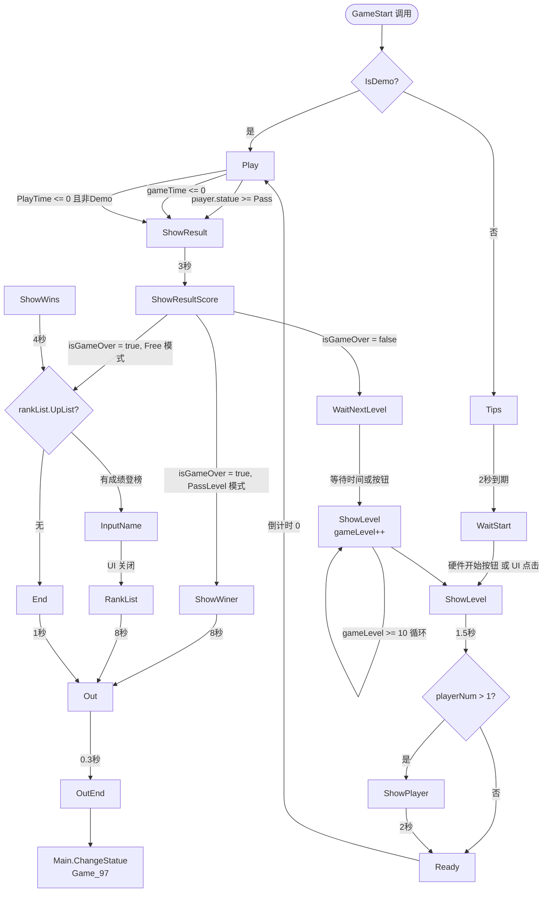

# Game01 模块完整技术架构文档

> 版本：基于 `KuPao_LaserBtn_v01.01.04` 源码分析  
> 生成日期：2026-02-22  
> 文档性质：逆向梳理文档，所有描述均有源码行依据

---

## 目录

1. [模块角色与生命周期](#1-模块角色与生命周期)
2. [主状态机（en_Game01_Sta）](#2-主状态机en_game01_sta)
3. [玩家状态机（en_Player01Sta）](#3-玩家状态机en_player01sta)
4. [三层流程：关卡 → 轮次 → 阶段](#4-三层流程关卡--轮次--阶段)
5. [游戏配置数据结构](#5-游戏配置数据结构)
6. [地图初始化与激光布局](#6-地图初始化与激光布局)
7. [硬件输入与碰撞检测](#7-硬件输入与碰撞检测)
8. [坐标系统](#8-坐标系统)

---

## 1. 模块角色与生命周期

### 1.1 模块角色

Game01 是整个 `LaserPPD_v2` 项目中的**激光闪避游戏模块**（激光按钮互动游戏）。它通过物理激光束和地面/墙面 LED 按钮阵列，要求玩家完成"踩灯 + 躲激光 + 按墙面按钮"交替进行的四个子阶段，以过关得分。

游戏模块的 `en_MainStatue.Game_01` 对应于整个主程序状态机中的一个独立游戏场景。

### 1.2 生命周期入口

**谁调用 `Awake0` 和 `GameStart`？**

入口位于 `Main.ChangeStatue(en_MainStatue)` 方法中：

```525:532:Assets\Scripts\Main.cs
case en_MainStatue.Game_01:
    prefab = Resources.Load<GameObject>(companyPath + "Prefabs/Game01_" + tab_Language[language]);
    game01_Main = Instantiate(prefab).GetComponent<Game01_Main>();
    game01_Main.Awake0(this);
    break;
```

```692:694:Assets\Scripts\Main.cs
case en_MainStatue.Game_01:
    game01_Main.gameObject.SetActive(true);
    game01_Main.GameStart();
```

**流程说明：**

1. `Main.ChangeStatue(en_MainStatue.Game_01)` 被外部（`Game97_Main` 关卡选择）调用
2. 若 `game01_Main` 对象不存在，则从资源路径 `"Prefabs/Game01_{语言}"` 实例化 Prefab，调用 `Awake0(this)` 完成引用绑定
3. 随后 `game01_Main.gameObject.SetActive(true)` 激活对象，调用 `GameStart()` 正式启动游戏

### 1.3 三个核心脚本的引用与协作

```
┌─────────────────────────────────────────────────────────────┐
│                        Main.cs                              │
│  public Game01_Main game01_Main;  // 外部调用入口           │
└────────────────────────┬────────────────────────────────────┘
                         │ Awake0(this) / GameStart()
                         ▼
┌─────────────────────────────────────────────────────────────┐
│                    Game01_Main.cs                           │
│  public Game01_Player player;    // 持有玩家引用            │
│  public Game01_GameUI gameUI;    // 持有 UI 引用            │
│  public int index_JieDuan;       // 轮次计数器              │
│  public int gameLevel;           // 当前关卡                │
│  public static Game01_Main instance; // 全局单例            │
└───────┬───────────────────────────────┬─────────────────────┘
        │ player.Awake0(this)           │
        │ player.GameStart(id)          │ Game_Map01.instance.Initmap()
        │ player.PlayStart()            │
        ▼                               ▼
┌──────────────────────┐    ┌──────────────────────────────┐
│  Game01_Player.cs    │    │       Game_Map01.cs           │
│  currJieDuan (0-3)   │◄───┤  protectTime (全局保护时间)  │
│  statue 玩家状态机   │    │  list_LightPos: Ledone 列表  │
│  tarageNum 目标计数  │    │  Jieduan_Now (待确认，恒为0) │
└──────────────────────┘    └──────────────────────────────┘
                                         │ Instantiate
                                         ▼
                             ┌──────────────────────────────┐
                             │     Game01_Ledone.cs          │
                             │  en_Move_Type 运动类型        │
                             │  pos_group: 光束位置列表      │
                             │  每帧: Moving() 逻辑          │
                             └──────────────────────────────┘
```

**关键交互点：**

- `Game01_Main` 在进入 `Play` 状态时调用 `player.PlayStart()`，启动玩家的阶段流程
- `Game01_Player` 的 `currJieDuan` 被 `Game_Map01.Update()` 和 `Game01_Ledone.Update()` 直接读取，用于决定当前激活哪种损伤检测
- `Game_Map01.protectTime` 是全局损伤冷却，由 `Game01_Ledone.Init()` 和 `Moving()` 以及 `Game01_Player` 阶段完成时统一重置
- `Game01_Main.instance` 为静态单例，供 `Game01_Ledone` 和 `Game_Map01` 反向访问主控

---

## 2. 主状态机（en_Game01_Sta）

### 2.1 状态枚举值及含义

```7:28:Assets\Scripts\Game\Game01\Game01_Main.cs
public enum en_Game01_Sta
{
    None = 0,
    Idle,
    Tips,
    WaitStart,
    ShowLevel,
    ShowPlayer,
    Ready,
    Play,           // 固定点
    Continue,
    ShowResult,
    ShowResultScore,
    WaitNextLevel,
    ShowWins,       // 单人结算奖励
    ShowWiner,      // 对战结算奖励
    InputName,
    RankList,
    End,
    Out,
    OutEnd,
}
```

| 状态 | 含义 |
|------|------|
| `None` | 枚举默认值，未使用 |
| `Idle` | 空闲态，关闭 UI 和玩家 |
| `Tips` | 显示游戏提示界面，持续 2 秒 |
| `WaitStart` | 等待玩家按开始按钮，开始按钮 LED 闪烁 |
| `ShowLevel` | 显示当前关卡号，持续 1.5 秒 |
| `ShowPlayer` | 多人模式下显示当前玩家号，持续 2 秒（单人跳过） |
| `Ready` | 倒计时 3 秒，播放倒计时音效 |
| `Play` | 游戏进行中，驱动玩家状态机和计时器 |
| `Continue` | 续玩界面，20 秒倒计时等待玩家投币 |
| `ShowResult` | 显示结果（Pass/Loss），持续 3 秒 |
| `ShowResultScore` | 滚动加分动画结算 |
| `WaitNextLevel` | 等待进入下一关，可按按钮跳过等待 |
| `ShowWins` | 单人模式结算奖励页，持续 4 秒 |
| `ShowWiner` | 对战模式结算奖励页，持续 8 秒 |
| `InputName` | 玩家输入排行榜名字 |
| `RankList` | 显示排行榜，持续 8 秒 |
| `End` | 结束过渡态，持续 1 秒 |
| `Out` | 退出过渡态，0.3 秒后返回 Game97 |
| `OutEnd` | 已发出退出指令，等待场景切换（无 Update 处理） |

### 2.2 主状态机流程图



---

## 3. 玩家状态机（en_Player01Sta）

### 3.1 状态枚举值及含义

```5:19:Assets\Scripts\Game\Game01\Game01_Player.cs
public enum en_Player01Sta
{
    Idle = 0,           // 空闲
    ReadyTargetLed,     // 准备目标灯(从远到近依次点亮)
    PlayTargetLed,      // 目标灯(打完所有目标灯后，开始正式游戏)
    ReadyPlayLed,       // 准备游戏灯(从近到远依次显示游戏图案)
    Play,               // 游戏中
    WaitPass,
    Die,                // 死亡    
    Pass,
    Loss,
    ResultScore,
    ShowWinner,
    GameOver,
}
```

| 状态 | 含义 |
|------|------|
| `Idle` | 空闲，显示分数面板 |
| `ReadyTargetLed` | 入场动画：棋盘格逐列点亮（每 0.03 秒一列，共 Width 列） |
| `PlayTargetLed` | 墙面目标灯游戏：随机显示 3-5 个墙灯，玩家需全部按下 |
| `ReadyPlayLed` | 过渡动画：从右向左逐列显示激光图案 |
| `Play` | 游戏核心状态，按 `currJieDuan` 分 4 种子逻辑 |
| `WaitPass` | 阶段完成后的过渡动画（逐列清空画面） |
| `Die` | 死亡动画（全屏逐列亮红） |
| `Pass` | 过关判断（检查 `index_JieDuan` 决定是否真正过关） |
| `Loss` | 失败结算（全屏红 + 失败音效） |
| `ResultScore` | 分数滚动动画 |
| `ShowWinner` | 显示对战胜利结果（当前基本未使用） |
| `GameOver` | 游戏彻底结束 |

### 3.2 Play 状态内部四个阶段（switch(currJieDuan)）

```246:333:Assets\Scripts\Game\Game01\Game01_Player.cs
switch (currJieDuan)
{
    case 0:
        UpdateLed(4);
        ch = 4;
        for (int i = 0; i < Set.ChannelLength[0]; i++)
        {
            Framebuffer.Update_TransmitLedColor(i, 0x60, enPointSta.Target);
        }
        CheckLedKey(4);
        ...
        if (tarageNum <= 0)
        {
            MusicManager.instance.Play_Correct();
            currJieDuan++;
            Game_Map01.instance.protectTime = 3;
            ChangeStatue(en_Player01Sta.WaitPass);
        }
        break;
    case 1:
        targetKeyId = (Sum of ChannelLength[0..4]) - 1;
        if (LedKey.KeyPressed(targetKeyId) || Input.GetKeyDown(KeyCode.Q))
        {
            MusicManager.instance.Play_Correct();
            currJieDuan++;
            Game_Map01.instance.protectTime = 3;
            ChangeStatue(en_Player01Sta.WaitPass);
        }
        break;
    case 2:
        UpdateLed(5);
        CheckLedKey(5);
        ch = 5;
        ...
        if (tarageNum <= 0)
        {
            MusicManager.instance.Play_Correct();
            currJieDuan++;
            Game_Map01.instance.protectTime = 3;
            ChangeStatue(en_Player01Sta.WaitPass);
        }
        break;
    case 3:
        targetKeyId = (Sum of ChannelLength[0..4]) - 2;
        if (LedKey.KeyPressed(targetKeyId) || Input.GetKeyDown(KeyCode.Q))
        {
            MusicManager.instance.Play_Correct();
            Game_Map01.instance.protectTime = 3;
            currJieDuan = 0;
            ChangeStatue(en_Player01Sta.Pass);
        }
        break;
}
```

**四个阶段的游戏内容对比：**

| currJieDuan | 类型 | 硬件通道 | 完成条件 | 激光状态 |
|------------|------|----------|----------|----------|
| 0 | 地面踩灯（10 个目标） | Channel 4 (PPD) | `tarageNum <= 0` | **不运动**（Game01_Ledone 跳过） |
| 1 | 墙面按钮 | Channel 4 末位按钮 | 按下 targetKeyId | **激光运动**（Game01_Ledone 激活） |
| 2 | 地面踩灯（10 个目标） | Channel 5 (PPD) | `tarageNum <= 0` | **不运动** |
| 3 | 墙面按钮 | Channel 4 倒数第二按钮 | 按下 targetKeyId | **激光运动** |

`Game01_Ledone.Update()` 中：

```236:240:Assets\Scripts\Game\Game_Map\Game01_Ledone.cs
if (Game01_Main.instance.player.currJieDuan != 1 && Game01_Main.instance.player.currJieDuan != 3)
    return;
Moving();
```

**ChangeStatue(Play) 时的初始化逻辑：**

```502:527:Assets\Scripts\Game\Game01\Game01_Player.cs
switch (currJieDuan)
{
    case 0:
        GetRandom_Tarage(4, 10);   // 随机在 channel 4 选 10 个目标灯
        GetOtherLed(4);            // 其余设为 Die (红色障碍)
        break;
    case 1:
        targetKeyId = (Sum of ChannelLength[0..4]) - 1;  // 最后一个按钮
        break;
    case 2:
        GetRandom_Tarage(5, 10);   // 随机在 channel 5 选 10 个目标灯
        GetOtherLed(5);
        break;
    case 3:
        targetKeyId = (Sum of ChannelLength[0..4]) - 2;  // 倒数第二个按钮
        break;
}
```

### 3.3 WaitPass 状态的完整逻辑

```356:383:Assets\Scripts\Game\Game01\Game01_Player.cs
case en_Player01Sta.WaitPass:
    runTime += Time.deltaTime;
    if (runCnt < Set.setVal.Width)
    {
        if (runTime >= 0.03f)
        {
            runTime = 0;
            for (int i = 0; i < Set.setVal.Height; i++)
            {
                GameLeiSheBase.Update_PointColor(runCnt, i, 0, enPointSta.None);
            }
            runCnt++;
        }
    }
    else if (runTime > 0.5f)
    {
        if (currJieDuan >= maxJieDuan)
        {
            ChangeStatue(en_Player01Sta.Pass);
        }
        else
        {
            ledControl.LedInit(Main.gameSetting.gameLevelSetting[gameMain.gameLevel]);
            PlayStart();
        }
    }
    break;
```

**WaitPass 流程：**
1. 逐列（每 0.03 秒一列）从左到右清空画面（每列所有行置黑）
2. 清空完成（`runCnt >= Width`）后，等待 0.5 秒
3. 判断：
   - `currJieDuan >= maxJieDuan`（即 ≥ 4）→ 进入 `Pass`（轮次完成）
   - 否则 → 重新初始化 LedControl，调用 `PlayStart()` 进入下一个 currJieDuan

`PlayStart()` 再次判断是否有墙面目标灯，决定从 `ReadyTargetLed` 还是 `ReadyPlayLed` 开始。

### 3.4 Pass 状态的完整判断逻辑

```536:555:Assets\Scripts\Game\Game01\Game01_Player.cs
case en_Player01Sta.Pass:
    if (Game01_Main.instance.index_JieDuan < 2)
    {
        Game01_Main.instance.index_JieDuan++;
        MusicManager.instance.Play_Correct();
        ChangeStatue(en_Player01Sta.ReadyTargetLed);
        break;
    }
    FjData.g_Fj[Id].Result = 1;
    result = 1;
    ...
    MusicManager.instance.Play_Talk(1, 1.2f); // "恭喜过关"
    FjData.g_Fj[Id].LevelTime = (int)gameMain.gameTime;
    currJieDuan = 0;
    break;
```

- 当 `index_JieDuan < 2` → 轮次未满，`index_JieDuan++`，重回 `ReadyTargetLed`（下一轮）
- 当 `index_JieDuan >= 2` → 真正过关，设置 `FjData.g_Fj[Id].Result = 1`，`result = 1`

### 3.5 Die / Loss 触发与处理

**Die 触发条件（三处）：**

1. `CheckRxKey()`：玩家身体阻断激光，`protectTime` 耗尽后 `FjData.g_Fj[0].Life--`（当前非 Editor 中实际不扣血，见注释）
2. `Game01_Ledone.Moving()`：激光条目经过玩家位置，`protectTime <= 0` 时 `FjData.g_Fj[0].Life--`
3. `Game_Map01.Update()`：当 `currJieDuan == 0 || 2` 时，列 x=0 若无人踩踏则扣血

```192:195:Assets\Scripts\Game\Game01\Game01_Player.cs
if (FjData.g_Fj[Id].Life <= 0)
{
    ChangeStatue(en_Player01Sta.Die);
    break;
}
```

**Die 状态动画：**

```385:403:Assets\Scripts\Game\Game01\Game01_Player.cs
case en_Player01Sta.Die:
    runTime += Time.deltaTime;
    if (runCnt < Set.setVal.Width)
    {
        if (runTime >= 0.03f)
        {
            runTime = 0;
            for (int i = 0; i < Set.setVal.Height; i++)
            {
                GameLeiSheBase.Update_PointColor(runCnt, i, GameLeiSheLedControl.LEISHE_COLOR, enPointSta.None);
            }
            runCnt++;
        }
    }
    else if (runTime > 0.5f)
    {
        ChangeStatue(en_Player01Sta.Loss);
    }
    break;
```

Die → 逐列点亮红色（每 0.03 秒一列），全亮后 0.5 秒 → 进入 `Loss`

**Loss 状态进入时：**

```557:569:Assets\Scripts\Game\Game01\Game01_Player.cs
case en_Player01Sta.Loss:
    ...
    GameLeiSheBase.Update_ColorFull(1, enPointSta.None);    // 全屏亮
    Framebuffer.Update_TargetLedColorAll(4, 0xff0000);       // 墙灯全红
    Framebuffer.Update_TargetLedColorAll(5, 0xff0000);
    MusicManager.instance.PlayOne(gameMain.audioClip_Loss, 0);
    MusicManager.instance.Play_Talk(2, 1.2f); // "挑战失败"
    break;
```

---

## 4. 三层流程：关卡 → 轮次 → 阶段

### 4.1 层级嵌套图

```
gameLevel（关卡，0-9，上限10，满后从0循环）
│
├── index_JieDuan（轮次，0 → 1 → 2，满3轮后真正过关）
│   │  [存储于 Game01_Main.index_JieDuan]
│   │
│   └── currJieDuan（阶段，0 → 1 → 2 → 3，满4阶后轮次完成）
│       │  [存储于 Game01_Player.currJieDuan]
│       │
│       ├── 阶段 0：地面踩灯（Channel 4，10 目标）
│       ├── 阶段 1：躲激光 + 按墙面按钮A
│       ├── 阶段 2：地面踩灯（Channel 5，10 目标）
│       └── 阶段 3：躲激光 + 按墙面按钮B
```

### 4.2 gameLevel（关卡）

- **初始值**：`gameLevel = Main.gameLevel`（由关卡选择界面设置）
- **递增时机**：`WaitNextLevel` 状态等待结束后

```497:510:Assets\Scripts\Game\Game01\Game01_Main.cs
gameLevel++;
if (gameLevel >= 10)
{
    gameLevel = 0;
    Main.playerMode++;
    if (Main.playerMode > en_PlayerMode.Challenge)
    {
        Main.playerMode = 0;
    }
    Game97_LevelSel.instance.OnClick_Level(1);
}
ChangeStatue(en_Game01_Sta.ShowLevel);
```

- **最大关数**：10 关（`gameLevel` 0-9），满后循环，并递增 `playerMode`
- **配置上限**：`maxLevel = Mathf.Min(Main.gameSetting.maxLevel, Main.gameSetting.gameLevelSetting.Length)`，`gameSetting.maxLevel` 默认值为 8

### 4.3 index_JieDuan（轮次）

- **初始值**：`Game01_Main.index_JieDuan = 0`（`GameStart()` 中设置）
- **递增时机**：`Game01_Player` 进入 `Pass` 状态时，若 `index_JieDuan < 2` 则 `+1` 并重启

```536:542:Assets\Scripts\Game\Game01\Game01_Player.cs
case en_Player01Sta.Pass:
    if (Game01_Main.instance.index_JieDuan < 2)
    {
        Game01_Main.instance.index_JieDuan++;
        ChangeStatue(en_Player01Sta.ReadyTargetLed);
        break;
    }
```

- **最大值**：2（即需满足 3 次 Pass：index 0→1→2，第 2 次时才真正过关）

### 4.4 currJieDuan（阶段）

- **初始值**：`0`（每次 `GameStart` 或 `ReadyTargetLed` 进入时重置）
- **递增时机**：每个阶段完成后，在进入 `WaitPass` 前执行 `currJieDuan++`
- **最大值**：`maxJieDuan = 4`，到达 4 后，`WaitPass` 转入 `Pass`

```54:55:Assets\Scripts\Game\Game01\Game01_Player.cs
public int maxJieDuan = 4;
public int currJieDuan = 0;
```

---

## 5. 游戏配置数据结构

> **⚠️ 注意**：任务描述中提及的 `LaserEntry`、`RoundConfig`、`LevelConfig`、`allLevelsConfig`、`lasers_stage2/4`、`InitDefaultLaserData()`、`Initmap_ForRound()` 等类和方法在本代码库中**均不存在**。实际使用的是 `GameSetting` 和 `GameLevelSetting` 两个类。

### 5.1 GameSetting（顶层游戏配置）

```9:38:Assets\Scripts\Fun\GameSetting.cs
[Serializable]
public class GameSetting
{
    public int maxLevel;        // 最大关卡数（默认 8）
    public string descript;
    public GameLevelSetting[] gameLevelSetting = new GameLevelSetting[30];
    
    public GameSetting()
    {
        maxLevel = Main.MAX_LEVEL;  // MAX_LEVEL = 15
        for (int i = 0; i < gameLevelSetting.Length; i++)
        {
            if (gameLevelSetting[i] == null)
                gameLevelSetting[i] = new GameLevelSetting();
        }
    }
}
```

- **持久化**：JSON 格式，存储路径 `persistentDataPath/LeiSheDeng/GameSetting/`
- **默认文件**：`tab_DefaultFiles` 中定义，从 `streamingAssetsPath` 加载

### 5.2 GameLevelSetting（单关配置）

```18:38:Assets\Scripts\Fun\GameLevelSetting.cs
[Serializable]
public class GameLevelSetting
{
    public int gameTime;        // 游戏时间（秒）
    public int life;            // 初始生命值
    public int targetPoint;     // 目标点个数
    public int wallLedNum;      // 墙灯个数
    public int bkWidth;         // 边框宽度
    public int targetNewType;   // 目标点生成方式（Random/Pic）
    public int targetDieType;   // 目标点死亡方式（ToNone/ToDie）
    public string presetPicName; // 激光图案预设名
    public string animInfoName;  // 动画信息名
    [NonSerialized] public PresetPic picSetting;   // 运行时加载
    [NonSerialized] public AnimSet animSetting;    // 运行时加载
}
```

**各字段的 Game01 实际使用情况：**

- `gameTime`：在 `Play` 状态下被 `Game01_Main` 倒计时，归零触发结算
- `life`：初始时赋给 `FjData.g_Fj[Id].Life = 100`（硬编码覆盖，见 GameStart 第 79 行）
- `wallLedNum`：`FjData.g_Fj[Id].TargetLed = Mathf.Min(Set.setVal.WallLedNum, gameLevelSetting.wallLedNum)`
- `picSetting`（`PresetPic`）：通过 `GameLeiSheLedControl.LedInit()` 加载，转换为 `PrePic_Copy[]` 用于激光图案渲染
- `animSetting`（`AnimSet`）：加载激光动画（在 Game01 中 `AnimsRun()` 已被注释掉，实际不使用动画）

**LeiSheWu（镭射舞）游戏类型的默认配置：**

```106:138:Assets\Scripts\Fun\GameLevelSetting.cs
case en_GameId.LeiSheWu:
    gameTime = 120;
    life = 4;
    targetPoint = 2 + level / 2;
    presetPicName = "D-" + (playerMode * 10 + level + 1).ToString("D3");
    if (playerMode == (int)en_PlayerMode.Challenge)
        animInfoName = "D-" + (level + 1).ToString("D3");
    else
        animInfoName = "";
    break;
```

### 5.3 GameLeiSheLedControl（激光 LED 控制）

```6:47:Assets\Scripts\Game\Game01\GameLeiSheLedControl.cs
public class GameLeiSheLedControl
{
    public static Dictionary<int, Vector2Int> ledCoordinate;
    public static int[] PrePic_Copy;   // 激光图案的布尔数组（1=有激光，0=无激光）
    public const uint LEISHE_COLOR = 63;  // 激光颜色值（亮度）
    
    public void LedInit(GameLevelSetting gameLevelSetting)
    {
        MaxChangeTime = Random.Range(5, 20);
        ChangeTime = MaxChangeTime;
        Pic_Init(gameLevelSetting.picSetting);
        AnimsInit(gameLevelSetting.animSetting);
    }
}
```

- `PrePic_Copy[]`：长度为 `Width * Height`，值 1 代表该位置有激光束，供 `CheckRxKey()` 判断
- `LedCoordinate()`：建立 LED 硬件 ID ↔ `Vector2Int(x, y)` 的映射字典

---

## 6. 地图初始化与激光布局

### 6.1 Initmap() 调用链

```22:37:Assets\Scripts\Game\Game_Map\Game_Map01.cs
public void Initmap()
{
    protectTime = 5;
    for (int i = 0; i < list_LightPos.Count; i++)
    {
        Destroy(list_LightPos[i].gameObject);
    }
    isclearall = false;
    maxJieduan = 4;
    list_LightPos = new List<Game01_Ledone>();
    GameLeiSheLedControl.PrePic_Copy = new int[Set.setVal.Width * Set.setVal.Height];
    GameLeiSheLedControl.LedCoordinate();
    Invoke("Initmap_Maze_" + (Main.MapIndex % 12).ToString("D2"), 0);
}
```

**完整调用链：**

```
Main.ChangeStatue(Game_01)
  └── game01_Main.GameStart()
        └── Game_Map01.instance.Initmap()
              ├── Destroy 所有旧 Ledone 对象
              ├── 重置 protectTime = 5
              ├── 重建 PrePic_Copy[]
              ├── 重建 ledCoordinate 字典
              └── Invoke("Initmap_Maze_XX", 0)  // Main.MapIndex % 12
                    └── New_LedOne(...)  × N  // 实例化激光条目
```

**⚠️ 潜在 Bug**：`Main.MapIndex % 12` 可取 0-11，但只定义了 `Initmap_Maze_00` ~ `Initmap_Maze_09` 共 10 个方法。当 `MapIndex % 12 == 10` 或 `11` 时，Unity 的 `Invoke` 不会抛出异常但也不会执行任何初始化，导致地图为空。

> **`Jieduan_Now` 待确认**：`Game_Map01.Jieduan_Now` 是公有字段，初始值为 0，被 `Initmap_Maze_00/01/02` 中的 `switch(Jieduan_Now)` 读取用于额外层级布局（case 1,2,3）。但在当前代码中该字段**从未被更新**，因此这些 `switch` 分支均不执行，实际上 Maze_00/01/02 只执行 `Jieduan_Now == 0` 的基础布局部分。

### 6.2 Game01_Ledone 的 en_Move_Type 枚举

```18:26:Assets\Scripts\Game\Game_Map\Game01_Ledone.cs
public enum en_Move_Type
{
    Stay,    // 0 - 静止不动（只渲染，每帧持续亮）
    Shake,   // 1 - 闪烁（每 max_runtime 秒翻转 isShaking 标志）
    OneWay,  // 2 - 单向平移（按 dir 方向循环移动，越界回绕）
    Down,    // 3 - 上下往返（从 y=0 向上，到边界返回，stayTime=1s）
    Up,      // 4 - 上下往返（同 Down，逻辑完全相同）
    Trun,    // 5 - 转圈（当前为空实现，预留）
}
```

**各运动类型行为说明：**

| 类型 | 行为 | 触发间隔 | 备注 |
|------|------|----------|------|
| `Stay` | 每帧更新位置显示，不改变坐标 | N/A | 最常用 |
| `Shake` | 每 `max_runtime` 秒翻转 `isShaking`；`isShaking=false` 时不渲染 | max_runtime | 类似闪烁 |
| `OneWay` | dir=0 向右（x+1 越界→0），dir=1 向左（x-1 越界→Width-1），整组坐标同步移动 | max_runtime | 循环滚动 |
| `Down/Up` | y 从 donw_Y 到 Height 往返，每步停留 1 秒 | max_runtime | Down/Up 代码逻辑完全相同 |
| `Trun` | 空实现 | N/A | 待开发 |

每次移动后 `Game_Map01.protectTime = 0.4f`（临时保护，防止移动瞬间误伤）。

**`isShaking` 机制说明：**

```177:222:Assets\Scripts\Game\Game_Map\Game01_Ledone.cs
if (isShaking)
{
    for (int i = 0; i < pos_group.Count; i++)
    {
        Framebuffer.Update_TransmitLedColor(pos_group[i].x, pos_group[i].y, 255, enPointSta.Target);
        if (LedKey.KeyStatus(startId + Framebuffer.MappingId(pos_group[i].x, pos_group[i].y)))
        {
            continue;  // 激光接收到信号（无遮挡），跳过
        }
        // 激光被遮挡（玩家在光束中）
        if (...Game01_Main.instance.statue == en_Game01_Sta.Play)
        {
            if (Game_Map01.instance.protectTime <= 0)
            {
                FjData.g_Fj[0].Life--;
                Game_Map01.instance.protectTime = 3f;
                ...
            }
        }
    }
}
```

`isShaking` 为 `true` 时渲染并检测碰撞；为 `false` 时完全跳过，实现"激光消失"的视觉效果。

### 6.3 各 Maze 激光布局速查

| Maze | 基础布局（Jieduan_Now=0） | 运动类型 | max_runtime |
|------|--------------------------|----------|-------------|
| **00** | 5 个独立点：(5,0), (W-2,3), (7,H-2), (9,H-2), (W/2,3) | Stay | 1.5s |
| **01** | 左上角 3×2 块 + 右半部 3×2 块 + 两个单点(W/4,0)/(3W/4,0) | Stay | 1.5s |
| **02** | 同 Maze_01 布局 | **OneWay**（向右滚动） | 1.5s |
| **03** | 全宽中段行（y=3~H-2）+ 左右角块（含3×2顶角）Stay；左右各2列底部（y=0~2）Shake | Stay + Shake | 1.5s |
| **04** | 全宽顶2行（y=H-2,H-1）Stay；每7个x一个单点（y=0）OneWay | Stay + OneWay | 1.5s |
| **05** | 每8个x的3高列（y=0~2）Stay；右侧3列顶2行 OneWay | Stay + OneWay | 1.5s |
| **06** | 每8个x的完整竖列（全高）OneWay | **OneWay** | **0.5s**（更快）|
| **07** | 全宽顶3行（y=H-3~H-1）Stay，donw_Y=H-3；8个单点（以W/2为中心，步进2，y=0）OneWay | Stay + OneWay | **1.0s** |
| **08** | 3组 3×3 块（x=0/8/16，y=H-3~H-1）OneWay；3个单点（y=0）Stay | OneWay + Stay | 1.5s |
| **09** | 全宽顶3行 + 3条完整竖列（x=0,W/2,W-1）组合为1个 Shake 对象 | **Shake** | **2.0s** |

---

## 7. 硬件输入与碰撞检测

### 7.1 CheckRxKey()——激光阻断检测

```908:990:Assets\Scripts\Game\Game01\Game01_Player.cs
void CheckRxKey()
{
    int len = Set.setVal.Width * Set.setVal.Height;
    for (int i = 0; i < len && i < GameLeiSheBase.gamePoint.Length; i++)
    {
        if (GameLeiSheBase.gamePoint[i].bindCnt > 0) continue;
        if (Framebuffer.led[i].colorOld == 0) continue;     // 该点无激光，跳过
        int JieShou_ID = i;
        if (Framebuffer.isNewLeiShe)
            JieShou_ID = GameLeiSheBase.tab_Point[i];       // 新版本硬件 ID 重映射
        if (GameLeiSheLedControl.PrePic_Copy[i] == 0) continue;  // 不在激光图案中，跳过
        if (Framebuffer.led[i].waitTime > 0) continue;

        if (LedKey.KeyStatus(rxKeyStartId + JieShou_ID))
        {
            // 激光接收器收到信号 → 玩家未遮挡 → 重置保护时间
            protectTime[JieShou_ID] = 2f - 0.02f * Set.setVal.LeiShe_LMD;
        }
        else if (statue == en_Player01Sta.Play)
        {
            // 激光被遮挡 → 保护时间递减
            protectTime[JieShou_ID] -= Time.deltaTime;
            if (protectTime[JieShou_ID] <= 0)
            {
                // 超时 → 触发扣血（Editor 下注释，Release 中有效）
                protectTime[JieShou_ID] = 2f - 0.02f * Set.setVal.LeiShe_LMD;
                GameLeiSheBase.gamePoint[i].bindCnt = 10;
                MusicManager.instance.Play_Fails();
            }
        }
    }
}
```

**硬件接口**：`LedKey.KeyStatus(rxKeyStartId + JieShou_ID)`
- `rxKeyStartId`：由 `LedKey.GetLeiSheKeyStartId()` 获取，为激光接收器通道的起始键 ID
- `JieShou_ID`：接收器 ID，对应物理激光接收单元的编号
- `KeyStatus` 返回 `true` = 接收器收到激光信号（无遮挡）；`false` = 信号被切断（玩家在光束中）

**触发扣血的必要条件：**
1. 该 LED 位置有激光（`PrePic_Copy[i] == 1` 且 `colorOld != 0`）
2. 玩家在状态 `Play` 中
3. 激光接收器连续被遮断超过 `protectTime[JieShou_ID]` 秒
4. `bindCnt == 0`（无冷却绑定）

### 7.2 CheckLedKey(int ch)——地面 LED 按键检测

```606:652:Assets\Scripts\Game\Game01\Game01_Player.cs
void CheckLedKey(int ch)
{
    for (int x = 0; x < Set.setVal.PPDWidth; x++)
    {
        for (int y = 0; y < Set.setVal.PPDHeight; y++)
        {
            int id = x + Set.setVal.PPDWidth * y;
            int pointId = id;
            for (int m = 0; m < ch; m++)
            {
                id += Set.ChannelLength[m];  // 计算全局 LED ID（跳过前几个通道）
            }
            if (LedKey.KeyPressed(id))
            {
                if (Framebuffer.led[id].statue == enPointSta.Target)
                {
                    // 踩中目标灯
                    Framebuffer.led[id].statue = enPointSta.None;
                    Framebuffer.Update_TargetLedColor(ch, pointId, 0);
                    FjData.g_Fj[0].Scores += 10;
                    MusicManager.instance.Play_Correct();
                    tarageNum--;
                }
                if (Framebuffer.led[id].statue == enPointSta.Die)
                {
                    // 踩中障碍灯
                    if (errorCD <= 0)
                    {
                        FjData.g_Fj[0].Scores -= 5;
                        errorCD = 1;
                        MusicManager.instance.Play_Fails();
                    }
                }
            }
        }
    }
}
```

**硬件接口**：`LedKey.KeyPressed(id)`——检测某个地面 LED 按键的**本帧是否被按下**（边沿触发）。

全局 LED ID 计算：`id = localId + sum(ChannelLength[0..ch-1])`

- 踩中 `Target` 灯：+10 分，`tarageNum--`，熄灭该灯
- 踩中 `Die` 灯：-5 分（若 `errorCD <= 0`，1 秒冷却）

### 7.3 CheckWallLedKey()——墙面目标按钮检测

```778:795:Assets\Scripts\Game\Game01\Game01_Player.cs
void CheckWallLedKey()
{
    for (int i = 0; i < Set.setVal.WallLedNum; i++)
    {
        if (GameLeiSheBase.targetLed[1 + i].statue == enPointSta.None) continue;
        if (LedKey.KeyStatus(wallKeyId + i) == false) continue;  // 未按下
        GameLeiSheBase.Update_TargetLedColor(1 + i, 0, enPointSta.None);
        if (FjData.g_Fj[Id].TargetLed > 0)
        {
            FjData.g_Fj[Id].TargetLed--;
            FjData.g_Fj[0].Scores += 5;
            MusicManager.instance.Play_Bomb();
        }
    }
}
```

**硬件接口**：`LedKey.KeyStatus(wallKeyId + i)`——检测墙面 LED 按钮的**电平状态**（非边沿）。
- `wallKeyId`：由 `LedKey.GetLeiSheWallLedKeyId()` 获取
- 按下则 `TargetLed--`，+5 分，熄灭该灯，播放音效

### 7.4 protectTime 的作用与重置位置

**Game01_Player.protectTime[]（每 LED 独立冷却，数组长度 1000）：**

| 位置 | 操作 | 值 |
|------|------|-----|
| `PlayStart()` 调用时 | 全部初始化 | `2f - 0.02f * LeiShe_LMD` |
| 激光接收器正常收到信号时 | 重置单个 | `2f - 0.02f * LeiShe_LMD` |
| 触发扣血后 | 重置单个 | `2f - 0.02f * LeiShe_LMD` |

作用：每个激光位置允许玩家遮挡 `protectTime` 秒才触发扣血，避免瞬间穿越时被误判。

**Game_Map01.protectTime（全局单一冷却）：**

| 位置 | 操作 | 值 |
|------|------|-----|
| `Initmap()` | 初始化 | 5 |
| `Game01_Main.GameStart()` | 初始化 | 5 |
| `Game01_Ledone.Init()` | 初始化 | 4 |
| `Game01_Ledone.Moving()` 每步移动后 | 重置 | 0.4f |
| 每个 `currJieDuan` 完成时（Player 中） | 重置 | 3 |
| `Game_Map01.Update()` 中扣血触发后 | 重置 | 1 |

作用：全局防止激光条目移动瞬间造成"移动误伤"，以及关卡切换时的初始免疫期。

---

## 8. 坐标系统

### 8.1 x / y 方向与原点

- **x**：横向，范围 `[0, Set.setVal.Width - 1]`，从左到右递增
- **y**：纵向，范围 `[0, Set.setVal.Height - 1]`，物理上从接近玩家端（y=0）到远离玩家端（即靠近墙面，y=Height-1）

**原点 (0, 0)** 位于地面 LED 阵列靠近玩家的左下角。

证据：`Initmap_Maze_01` 中顶部障碍物使用 `Height - 1 - k`（k 从 0 开始），得到的 y 值为 `Height-1`（最大），即远端/上方：

```137:143:Assets\Scripts\Game\Game_Map\Game_Map01.cs
for (int i = 0; i < 3; i++)
{
    for (int k = 0; k < 2; k++)
    {
        pos.Add(new Vector2Int(i, Set.setVal.Height - 1 - k));
```

### 8.2 两种 New_LedOne 重载的区别

**重载一：单点版本**

```39:51:Assets\Scripts\Game\Game_Map\Game_Map01.cs
Game01_Ledone New_LedOne(int x, int y, int dir, Game01_Ledone.en_Move_Type move)
{
    if (x < 0 || x >= Set.setVal.Width || y < 0 || y >= Set.setVal.Height)
        return null;    // 越界时安全返回 null
    Game01_Ledone one = Instantiate(obj_Led, this.transform);
    one.Init(x, y, dir, move);
    list_LightPos.Add(one);
    return one;
}
```

- 适用于单个 LED 点的激光条目
- 有边界检查，越界返回 null
- `Init(x, y, ...)` 会将 `(x, y)` 添加到 `pos_group`

**重载二：多点版本**

```52:59:Assets\Scripts\Game\Game_Map\Game_Map01.cs
Game01_Ledone New_LedOne(List<Vector2Int> _pos, int dir, Game01_Ledone.en_Move_Type move)
{
    Game01_Ledone one = Instantiate(obj_Led, this.transform);
    one.Init(_pos, dir, move);
    list_LightPos.Add(one);
    return one;
}
```

- 适用于一组 LED 点构成的激光条目（块状/线状）
- **无边界检查**（边界过滤在 `Init` 内部进行）
- 适合 Maze 布局中定义复杂形状的激光障碍

### 8.3 坐标映射公式

**逻辑图像 ID（picId）：**

```
picId = x + Width * y
```

行主序（每行 Width 个点，y=0 为第一行），与 `GetRandom_Tarage` 等处的计算一致：

```662:665:Assets\Scripts\Game\Game01\Game01_Player.cs
int id = randomX + randomY * Set.setVal.PPDWidth;
```

**`Framebuffer.tab_Mapping[picId]` 的作用：**

```162:163:Assets\Scripts\Game\Game01\GameLeiSheLedControl.cs
id = Framebuffer.tab_Mapping[i];
```

`tab_Mapping` 是物理布线映射表，将**逻辑顺序索引**（按行列排列的 `picId`）映射到**实际硬件 LED ID**（按物理走线排列）。这处理了 LED 灯带蛇形走线、通道分组等硬件差异。

**`Framebuffer.MappingId(x, y)` 的作用：**

```198:199:Assets\Scripts\Game\Game_Map\Game01_Ledone.cs
Framebuffer.Update_TransmitLedColor(pos_group[i].x, pos_group[i].y, 255, enPointSta.Target);
if (LedKey.KeyStatus(startId + Framebuffer.MappingId(pos_group[i].x, pos_group[i].y)))
```

`MappingId(x, y)` 将 `(x, y)` 坐标直接转为硬件 ID，供 `LedKey.KeyStatus` 读取该位置的传感器状态。

**坐标到通道的全局 ID 计算（PPD 层）：**

在 `CheckLedKey` 中：
```
globalId = localPPDId + sum(ChannelLength[0], ..., ChannelLength[ch-1])
```

其中 `localPPDId = x + PPDWidth * y`，通过累加前置通道的长度得到全局 LED 数组中的实际偏移量。

---

## 附录：待确认项汇总

| 编号 | 问题 | 位置 |
|------|------|------|
| ① | `Game_Map01.Jieduan_Now` 从未被更新（始终为 0），Maze_00/01/02 中 case 1/2/3 分支永不执行，可能是遗留的多阶段地图切换逻辑 | `Game_Map01.cs:10` |
| ② | `Initmap_Maze_10` 和 `Initmap_Maze_11` 方法不存在，当 `Main.MapIndex % 12` 取 10 或 11 时地图初始化静默失败 | `Game_Map01.cs:36` |
| ③ | `CheckRxKey()` 中的扣血逻辑用 `#if !UNITY_EDITOR` 包裹，在 Editor 模式下不扣血，Release 模式下有效 | `Game01_Player.cs:974` |
| ④ | `Game_Map01.Update()` 中对 x=0 列的扣血逻辑意图不明：对 x=0 的所有 y 进行检测，若未踩则扣血，物理含义待结合硬件说明确认 | `Game_Map01.cs:484-500` |
| ⑤ | `en_Move_Type.Down` 和 `en_Move_Type.Up` 的 `Moving()` 代码完全相同，两者行为无差异，可能是拷贝遗漏 | `Game01_Ledone.cs:110-134` |
| ⑥ | `GameLeiSheLedControl.AnimsRun()` 和相关代码被注释，激光动画（animSetting）实际在 Game01 中未启用 | `GameLeiSheLedControl.cs:91-107` |
